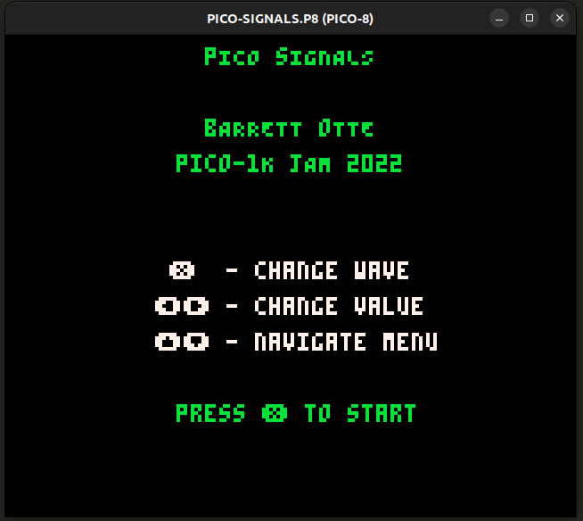
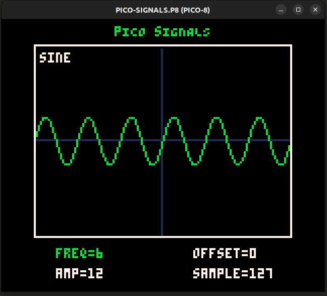
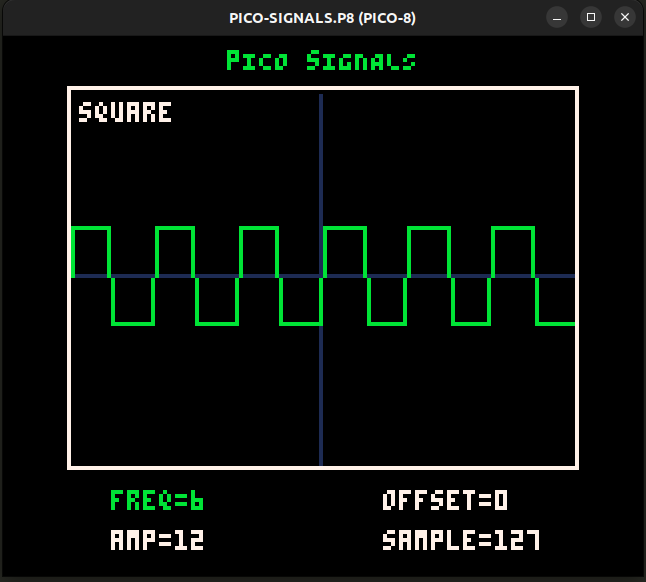
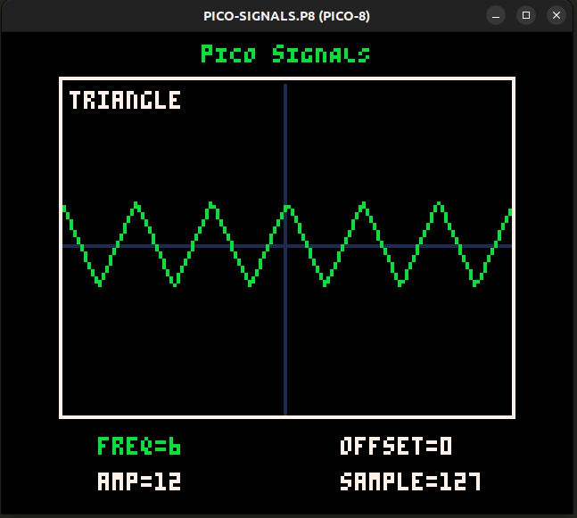
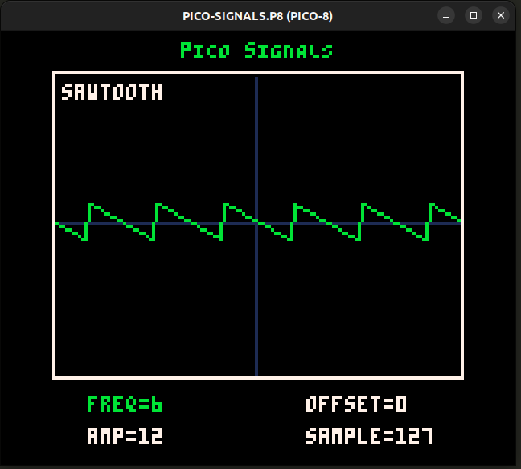
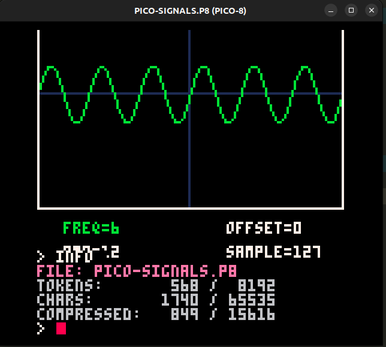

# pico-signals

A small signal generator in PICO-8. My entry for the PICO-1K Jam 2022.

[Pico 1K Jam 2022 (09/01 - 09/30)](https://itch.io/jam/pico-1k-2022) - [my entry](https://itch.io/jam/pico-1k-2022/rate/1706193)

Play at [https://barrettotte.itch.io/pico-signals](https://barrettotte.itch.io/pico-signals)

## Description

A little "signal generator" with sine, square, triangle, and sawtooth waves.
The wave's frequency, amplitude, and offset can be changed. 
A sample rate can also be set that controls how smooth the wave is drawn.

For the game jam I compressed my code to 849 bytes. I could probably do better, but I met my goal of getting under 850.
The uncompressed version of source is at [docs/pico-signals-uncompressed.p8](docs/pico-signals-uncompressed.p8).

### Screenshots

  
Title screen

  

  
Sine wave

  

  
Square wave

  

  
Triangle wave

  

  
Sawtooth wave

  

  
Compressed bytes output

  

## Controls

<ul>
  <li><kbd>x</kbd> - Change wave form</li>
  <li><kbd>←</kbd> / <kbd>→</kbd> - Change wave values</li>
  <li><kbd>↑</kbd> / <kbd>↓</kbd> - Navigate menu</li>
</ul>

## Development

- Build - `make`
- Build and run - `make run`

### HTML Build

I couldn't figure out a way to include this in the makefile for automation...something about a cart label needed.
Within PICO-8 run `EXPORT INDEX.HTML`

## References

- [PICO-8 gamedev series](https://forum.clockworkpi.com/t/pico-8-gamedev-1-getting-started-tutorial/2347)
- [PICO-8 command line](https://pico-8.fandom.com/wiki/RunningPico8)
- [PICO-8 HTML manual](https://www.lexaloffle.com/dl/docs/pico-8_manual.html)
- [PICO-8 token optimizations](https://github.com/seleb/PICO-8-Token-Optimizations)
- [Poking sounds into PICO-8 memory](https://www.lexaloffle.com/bbs/?tid=2341)
- wave formulas
  - https://en.wikipedia.org/wiki/Sine_wave#Formulation
  - https://en.wikipedia.org/wiki/Square_wave#Definitions
  - https://en.wikipedia.org/wiki/Triangle_wave#Definition